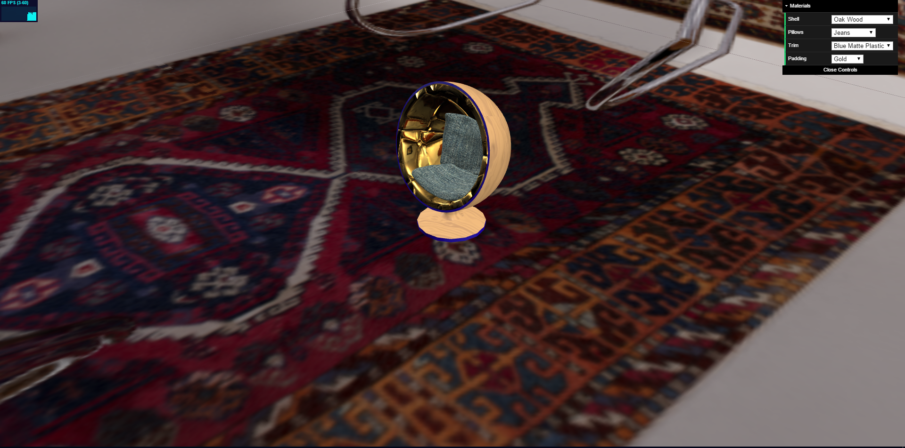
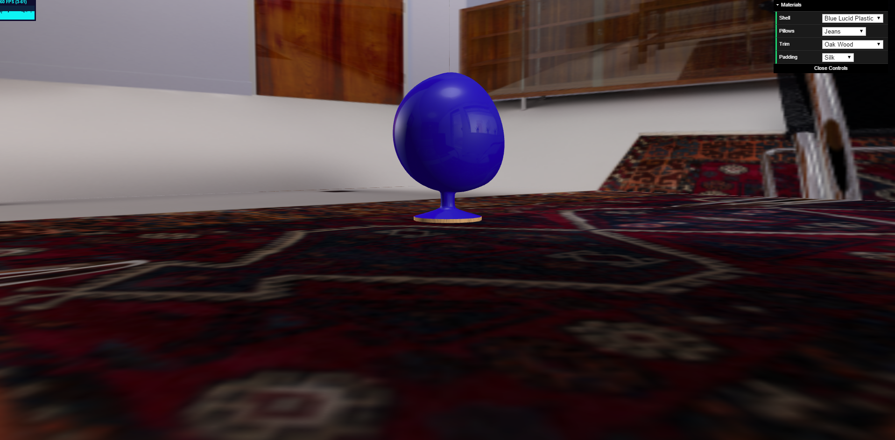
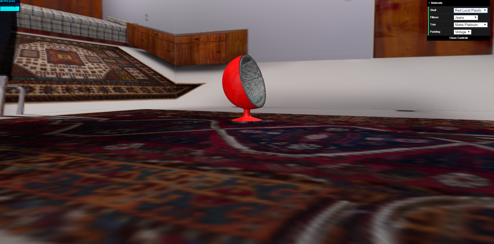

<meta charset="utf-8">

# DESCRIZIONE

L'idea è stata quella di creare un configuratore 3D di sedie, che mostra un modello 3D configurabile all'interno di un ambiente chiuso.
Il progetto fa uso delle librerie di Three.js contenute in lib, delle textures per i modelli contenute nella cartella textures,
un file index.html contenente il codice 'finale' del progetto, un file product-visualization.html che contiene il codice per gli shader, le luci, la cubemap.
La BRDF utilizzata è quella vista a lezione, modificata in modo da integrare l'uso di 3 luci, la normal map, la displacement map e la environment light per le 
varie parti dell'oggetto.

----------------------------------------------------------------------------------------------------------------------------

# RISULTATI
Il risultato finale è un configuratore 3D che permette di cambiare materiali e colori alle varie parti del modello (guscio, imbottitura,
contorni e cuscini); inoltre è possibile sia ruotare la telecamera attorno all'oggetto, sia fare lo zoom,
in modo da vedere il prodotto da più angolazioni. I movimenti sono stati limitati in modo da non oltrepassare i limiti della stanza e
da non entrare nell'oggetto.
Il modello 3D riflette le pareti di una cubemap (non visibili), in modo che il cliente possa farsi un'idea di come starebbe l'oggetto in una stanza. 

# IMMAGINI

--------------------------------------------------------------------------------------------------------------------------------

# PROCESSO

I modelli sono stati scaricati già creati in formato OBJ e importati con il loader di THREE.js.
Per scaricare e modificare le textures è stato usato il software Substance Player.
Per gli shader è stato deciso di scriverli unendo quelli degli esempi delle lezioni e apportando le modifiche necessarie ad adattarli al progetto.
Per l'ambiente è stato scelto di creare una cubemap di un salotto in modo da vedere gli effetti di riflessione sull'oggetto.

Dopo le indicazioni ricevute dal prof è stato scelto di usare il template "Freebie: responsive landing page template with Flexbox" per avere una
home page e una GUI adatte ad un configuratore 3D utilizzabile in un sito di ecommerce.
La cubemap è stata eliminata ma i riflessi sul modello sono stati mantenuti. 

<!-- Markdeep: -->

 